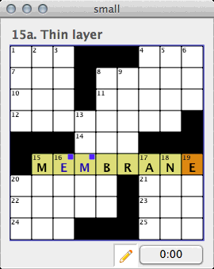
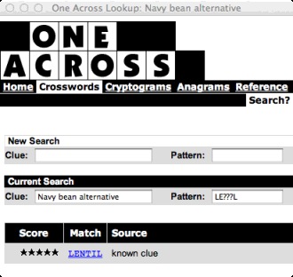

Solving a Puzzle
================

Puzzle Board
------------

Depending on the choices you made in preferences, the list of clues for your
puzzle may or may not appear on the right-hand side of the puzzle grid.
Regardless, as you move around the puzzle, the currently selected clue will
appear in bold over the grid.

Moving Around
-------------

You can move around the board with the arrow keys. This will change direction
and then begin moving in the new direction. You can also use the mouse to click
on a cell.

To switch the current direction, you can use the `Enter` key or the spacebar.

You can also click in a clue list to jump to the square that begins that clue.
You can also press `Tab` to move onto a clue list and then up/down arrow to
choose a clue, followed by `Enter` to move back to the board for that space.

For full instructions on keyboard shortcuts during puzzle solving, see
:ref:`Keyboard Navigation <my-keyboard-shortcuts>`. 

Entering Letters
----------------

To enter letters in the grid, you can just type them. Depending on the choices
you chose in the :ref:`Keyboard Navigation <my-keyboard-navigation>` section 
of the preferences, letters that are already filled in may be skipped over 
so you don't have to type them.

Some puzzles contain "rebuses": cells where the answer isn't a single letter
but a symbol or a word. For example, a puzzle may have the words "HEART",
"SPADES", "CLUBS", and "DIAMONDS" in four spaces rather than simple
letters. If a puzzle has rebus spaces, you can enter these using `Edit`
|rarr| `Enter Special Characters`.

Normally, when the puzzle has been completed, a dialog will pop up to
congratuate you. If you do not want this automatic notification of a completed
puzzle, you can disable this in the preferences, in 
:ref:`Disable auto-notification of puzzle completion <my-tournament-settings>`.

Pencil versus Pen
-----------------

If you'd like to note which answers you're less sure of, you can switch to
"pencil mode". To do this, choose `Edit` |rarr| `Use Pencil` (or use the
keyboard shortcut), or click the pencil icon at the bottom of the
puzzle window. Answers filled out in pencil are lighter and not in bold. To
switch back to pen mode, choose `Edit` |rarr| `Use Pen`, or click the
pencil icon back out.

Regardless of whether you've filled out a square in pencil or pen, |NAME| works
the same with regard to checking your work, considering the puzzle solved, etc.

Checking Your Work
------------------

You can check the current letter, current word, or entire puzzle for errors.
These choices are in the `Puzzle` |rarr| `Check` submenu.

Once checked, cells that were correct remain unmarked. Squares that have
errors will be marked. Once the correct answer has been put in the cells, they
will be marked differently to show that they were once incorrect, but have
been corrected:

   Example board with checked letter and checked-now-correct letter.

In the preferences, in ":ref:`Puzzle Flags <my-puzzle-flags>`", 
you can choose to see incorrect and previously-incorrect
squares as graphical flags, colored letters, both, or neither.

In the preferences, there are options for ":ref:`Tournament Settings
<my-tournament-settings>`", 
where you can prevent yourself from checking answers.

Revealing Correct Answers
-------------------------

You can also reveal the correct letters, using the options in `Puzzle`
|rarr| `Reveal` submenu.

Once revealed, cells may show a symbol or colored letter. You can change in the
preferences, in ":ref:`Puzzle Flags <my-puzzle-flags>`", how revealed cells 
are displayed.

  Example board with revealed letters.

In the preferences, there are options for ":ref:`Tournament Settings
<my-tournament-settings>`", 
where you can prevent yourself from revealing correct answers.

Timer
-----

Looking for a challenge? You can time your puzzle solving.

You can start and pause the timer either by clicking the timer button at the
bottom of the puzzle window or by using the `Start Timer`, `Restart Timer`,
and `Pause Timer` options in the `Puzzle` menu.

In addition, you can also reset the puzzle timer to zero.

In the preferences, there are options for ":ref:`Tournament Settings
<my-tournament-settings>`", 
where you can make sure the timer starts running immediately on opening a 
puzzle and can prevent yourself from pausing the timer.

Locked Puzzles
--------------

Some puzzles ship with solutions that are encrypted. These puzzles cannot
usually be checked nor can the solution be revealed.

For encrypted puzzles, there is an option, `Puzzle` |rarr| `Unlock
Puzzle`.  This decrypts the solution by guessing every possible key. On a
slower computer, this may take a few minutes. After the solution has bene
decrypted, you can check or reveal answers as usual.

You can also choose to lock a puzzle to encrpyt the solution by using 
`Puzzle` |rarr| `Lock Puzzle`. You will be prompted for a 4-digit key to
use to encrypt the puzzle (a random one will be displayed as a suggestion).
Once locked, the puzzle must be unlocked to view the solution or check answers.

In the preferences, there are options for ":ref:`Tournament Settings
<my-tournament-settings>`", 
where you can prevent yourself from unlocking locked puzzles.

OneAcross.com
-------------

OneAcross.com is a site that can provide guesses for crossword puzzles given
the clue and letters guessed so far. You can use this for hints or ideas if you
are stuck by choosing `Puzzle` |rarr| `OneAcross.com Lookup`.

   OneAcross.com

In the preferences, in ":ref:`Tournament Settings <my-tournament-settings>`",
there are options to prevent you from using OneAcross.com.

Google Answer
-------------

Once you've filled in an answer (or revealed it), it can be interesting
to gain some insight into it. To open a Google window about the current word,
choose `Puzzle` |rarr| `Google.com Lookup`.

Undo, Redo, and Revert to Saved
-------------------------------

You can use `Undo` and `Redo` in the `Edit` menu to undo any work done to the
puzzle (including clearing it, checking your work, or revealing letters).

You can use `Revert to Saved` under the `File` menu to re-open the puzzle as it
was last saved.
