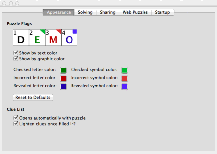

Preferences
===========

Preferences are saved on-disk (either in a file or, for Windows, in the
system registry). Changes are saved automatically when you close this window.

Appearance
----------

   Appearance tab.

.. _my-puzzle-flags:

**Puzzle Flags**

You can change whether you are notified of checked squares and revealed squares
using either graphical flags, colored letters, both or none. In addition, you
can change the colors used for flags or letters.

For graphical symbols, checked squares that have been corrected default to a
green triangle. Checked squares that are still incorrect default to a red
triangle.  Revealed squares default to a blue square.

**Clue List**

- `Opens automatically with puzzle`: Does clue list show by default on new 
  puzzles?  You can always change this while working on a puzzle by choosing 
  `Puzzle` |rarr| `Clues` |rarr| `Show Clue List`.

- `Lightens clues once filled in`: Once a clue has been filled out on the
  grid, the corresponding clue in the clue list will be lightened, so
  it's easy to see which clues have not yet been completed. Note that the
  lightening is done when the clue is *filled out* -- it does not
  neccessarily mean the answer is correct.

Solving
-------

   Solving tab.

**OneAcross / Google Lookup**

You can choose whether an internal browser window is used, or whether your
computer's default browser application is opened.

.. _my-keyboard-navigation:

**Keyboard Navigation**

- `Skip filled letters when entering word`: when filling out the grid, does the
  cursor skip over letters that have already been filled out?

- `Stop at word end when entering word`: if selected, when filling out a word,
  the cursor stops moving at the end of the word. If unselected, it continues
  to the next word.

.. _my-tournament-settings:

**Tournment Settings**

These options all can make |NAME| more challenging, by locking you out of
options that can help solve puzzles.

- `Disable checking/revealing answers`: Disables menu options for checking the
  grid or revealing letters. Answers already checked or uncovered stay as such.

- `Disable auto-notification of puzzle completion`: Disables the pop-up box
  that shows the puzzle has been completed.

- `Disable puzzle solution unlocking`: Disables the option to unlock puzzle
  solutions on locked puzzles.

- `Disable OneAcross.com assistance`: Disables the option to use oneacross.com
  for hints.

- `Start timer on puzzle start`: Starts the timer automatically when the 
  puzzle is opened.

- `Disable pausing timer`: Disables pausing and resetting of timer.

**Solving Feedback**

- `Flash when word completed correctly`: When the word you're on is
  completed, briefly flash green for correct or red for incorrect.

Sharing
-------

.. figure:: sharing.gif

   Sharing tab.

**Google Talk/Jabber Connection Information**

These are the default choices that will appear in the connection box when
you share or join a shared puzzle.

.. _my-join-share-prefs:

**On Joining or Sharing a Joined Puzzle**

- `Skip prompting for information and always use above`: Do not prompt each
  time for server, username, and password. Instead, use the values above. This
  option is only available if all the options above have been filled out.

- `Stay invisible while connecting`: If not selected, you may appear "online"
  to your IM buddies for a moment while starting to share or join a puzzle,
  even if you are not in a traditional IM program. If you want to make sure
  that you this does not cause you to appear online, you can select this.

  If selected, however, |NAME| cannot use automatic invitations--so when
  sharing or joining a puzzle, you'll need to enter the invitation codes.
  See "Manual Connections" in the sharing section of the help.

.. _my-ingame-messaging:

**In-Game Messaging** 

- `Sending message in game automatically returns keyboard focus to grid`: after
  sending an IM in |NAME|, the keyboard is returned to the puzzle grid (so
  typing letters will show up as solving on the grid, rather than in
  the IM entry box.

  If you often send multiple messages in a row, you may find this inconvenient.
  Unchecking it keeps the focus in the message entry box; you can click in the
  grid (or press `Tab`) to move the focus back to the board.

- `Play sound when receiving IM`: play a "blip" sound when receiving an IM
  in |NAME|.

- `Flash window when receiving IM`: should the messaging window flash pink for
  a second when receiving an IM. This is especially helpful if you've turned
  off sounds.

Web Puzzles
-----------

   Web puzzles tab.

From here, you can enable/disable, add, delete, or edit the sources for 
web puzzles.

To edit or delete a web puzzle, click on it in the list. You can then edit its
properties or delete it (note: you cannot delete the sources that come with
|NAME| -- but you can delete them so they no longer appear in the list.

:Puzzle name: Name of the Puzzle source, as it should appear.

:URL Template: the URL where this puzzle should appear. Almost all sources will
  use a different URL for different dates, so you can use codes in this string
  that will become parts of a date. For example: `http://example.com/%y-%m-%d`
  will become `http://example.com/11-12-25` for Christmas day, 2011. A list of
  substitution letters is show on the preferences screen. Should you need a
  more complete list of possibilities, you can find these at
  http://strftime.net/.

:Description: Description of the source, as it should appear.

:Days Expected: Many sources only publish a puzzle once a week or a few
  times a week. Select the days when new puzzles should be expected to appear.
  |NAME| will only try to download puzzles on these days.

:Enabled: If disabled, does not appear in listing.

It is possible to use |NAME| with sources that require log in,
like the New York Times premium crosswords, but to do so, you'll have
to see up the cookies require to authenticate. For information, see
:ref:`my-web-cookies`.

Startup
-------

   Startup tab.

**On Startup**

- `Re-open puzzles from last session`: Should we open puzzles that were left
  open when you last quit the program?

- `Show tip of the day`

- `Check for upgrades`: |NAME| will never automatically upgrade itself, but it
  can alert you to new updates, and open a browser window where you can
  download the new version yourself.

**If No Puzzles Are Opened**

What should happen if the application is opened without any puzzles?

- `Show Web Puzzle chooser`: Show a list of web sources for puzzles.

- `Show standard Open File chooser`: Prompt you to find a puzzle saved on disk.

- `Join shared puzzle with friend`: Prompt you through joining a shared puzzle.

- `Do nothing`: Do none of these things.

