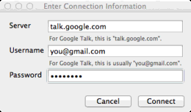
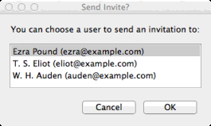
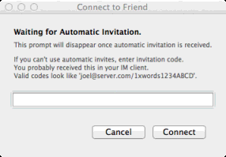
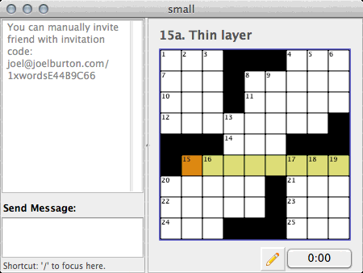
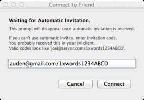
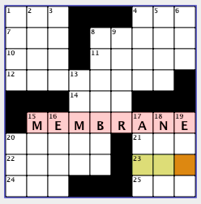
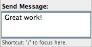

Collaborative Solving
=====================

With |NAME|, you can solve a crossword puzzle online together with one
or more other friends.

To do so, you will both need instant messaging accounts on systems that work
with the Jabber/XMPP protocol. Google Talk is a very well-known example of this
type of system, but many other IM servers offer these types of accounts.

.. note:: 
   While Facebook can connect to XMPP servers, it does not implement enough
   of the protocol to be used. At this time, you cannot use your Facebook
   IM account to play puzzles together.

On most IM systems, members cannot send messages to each other until they have
subscribed to each other (some systems may call this "Adding a user",
"Friending a user", or similar things). You should make sure you have
subscribed to each other before attempting to play games together. A good way
to test this is to send messages using your normal IM client (such as Google
Talk).

It is possible for the players to share a single IM account to play together,
however, they will have to connect using manual invitations (see below).

Sharing a Puzzle
----------------

If you have opened a puzzle you'd like to share with one or more friends, 
ask your friends
to connect first in their copy of |NAME| by using the `File` |rarr|
`Join Shared Puzzle...`. By having them connect first and be waiting for you,
they'll receive your invitation and the connection is automatically accepted.

Then, you should choose `File` |rarr| `Share Puzzle...`. 
This will prompt you for your IM connecting information:

   Connection box.

Fill out the fields:

:Server: The address of your server. For Google Talk, this should be
   `"talk.google.com"`.

:Username: Your username on the system. This is usually of the form
   "user@server.com". For Google Talk, this will often be `"you@gmail.com"` --
   however, if you have a Google Apps account, this might be your personalized
   account, such as `"you@yourdomain.com"`.

:Password: Your password. This will appear as stars as your enter it.

Once you've connected successfully, you will be given a list of your
subscribed buddies on the server:

   Buddies list.

Choose your friends from the list. 

Your puzzle will open up a "sharing panel", where messages to/from your
connected friends can appear. At the top of this window will appear the
invitation that was sent to your friend.

Assuming your friends were already logged in with their copy of |NAME|, they will
have received your invitation and automatically join to you. You will receive
notification that they've joined in a second or two in the sharing panel.

If a connection is not made, it is possible that your friends were not already
logged into |NAME| using "Join Shared Puzzle..." and waiting for you. 
If that might be the case, you can choose `File` |rarr| `Resend Invitations...` 
and re-send them an automated invitation to play.

If this does not work, it is possible that you or your friends are in
"Invisibility mode" and cannot send or receive automated invitations. In this
case, you can connect with a manual invite code. See
:ref:`my-manual-connections`. For information on invisibility mode, see
:ref:`Stay invisible while connecting <my-join-share-prefs>`.

Adding Additional Friends
-------------------------

The person who originally shared the puzzle can invite additional 
people by choosing `File` |rarr| `Resend Invitations...` and selecting
additional people to join.

Joining a Puzzle
----------------

To join a friend, choose `File` |rarr| `Join Shared Puzzle...`.
This will prompt you for your IM connecting information:

   Connection box.

Fill out the fields:

:Server: The address of your server. For Google Talk, this should be
   `"talk.google.com"`.

:Username: Your username on the system. This is usually of the form
   "user@server.com". For Google Talk, this will often be `"you@gmail.com"` --
   however, if you have a Google Apps account, this might be your personalized
   account, such as `"you@yourdomain.com"`.

:Password: Your password. This will appear as stars as your enter it.

Once you've connected successfully, you will be told you are waiting
for an automatic invite:

   Invitation waiting box.

**You do not normally need to fill anything in here.** Instead, at this point,
you can tell your sharing friend to begin sharing the puzzle on their end (you can do
this over IM or phone). When they've begun to share the puzzle, they'll
send you an automated invitation which will dismiss this prompt and you will
connect to their puzzle.

Your puzzle will open up a "sharing panel" on the left, where messages to/from
your connected friends can appear. At the top of this window will appear a
message showing you've connected to your friend.

If you do not connect to your friend automatically, it is possible that your
sharing friend did not send the automated invitation after you connected. You can
ask them via IM or phone to choose `File` |rarr| `Resend Invitations...`. 
Once they've done so, you should connect.

If this does not work, it is possible that you or your sharing friend are in
"Invisibility mode" and cannot send or receive automated invitations. In this
case, you can connect with a manual invite code. See
:ref:`my-manual-connections`. For information on invisibility mode, see
:ref:`Stay invisible while connecting <my-join-share-prefs>`.

.. _my-manual-connections:

Manual Connections
------------------

On some IM systems, it may not be possible to use automated invitations. It's
also possible that you or your friend has selected "invisibility mode", where
you never appear logged on to your IM system, even for a second (for
information on this, see preferences). If this is the case, you can
connect using manual invitation codes.

When the person sharing the puzzle is prompted for the friend to invite, they
can decline to send a code by choosing "Cancel". 
The sharing panel will show them an invitation code they can use:

   Sharing panel with invitation code at top left.

You can send this code, via IM/phone/email, to the joining friend.

When the joining friend has connected to the server, they will be prompted for
their invitation code:

   Entering an invitation code.

If they enter the invitation code, they can connect to you.

.. note::
   The invitation code is the entire string shown, it will look like
   `user@server.com/1xwords` or `user@server.com/1xwords12345678`
   They need to enter it exactly as shown (and with the same capitalization).

Solving Collaboratively
-----------------------

Once you've connected to each other, you can solve the puzzle together.
Almost all of the features work the same--you can move around, fill in squares,
clear squares, check your work, reveal answers, etc. Any change made on one
person's puzzle is immediately shown to the other players.

So as not to confuse users when one uses undo or redo and the others do not,
undo/redo are disabled when working on shared puzzles.

There may be times you want to draw your friends' attention to a particular
word on the puzzle (perhaps you're stumped on it, or want to brag about solving
a particularly clever clue). You can highlight this clue on their end
by selecting the word in the puzzle grid and then choosing `Puzzle` |rarr|
`Highlight Answer`. This will cause that word to stay lit up in pink on both
your board and your friends' boards, making it easier to notice.

   A highlighted block.

When you'd like to clear any highlighted squares on your board, you can choose
`Puzzle` |rarr| `Clear Highlights`.

Sending Messages
----------------

While playing your game, you can send messages to your friends. To do so, click
in the message entry box at the bottom left of the puzzle window, and type your
message.  Pressing Enter (or Return) will send your message and return keyboard
control to the puzzle window.

   Sending an IM.

.. note:: 
   A useful keyboard shortcut: you can type "/" to move the keyboard focus
   to the message entry box.

Like in many other IM systems, you can start a message with "/me" to make it
look like a "status message": for example, "/me is amazed at your skill" will
appear in italics on your friends' computers as "(yourname) is amazed at your
skill". If you really need to get the attention of the other solvers, 
you can start your message with "/popup" (like "/popup I have to stop in
3 minutes"), which will cause a box to pop up on their screens.

If you'd rather have the keyboard focus stay in the message entry box so you
can more easily send a follow up messages, you can change this in preferences,
in ":ref:`Sending message in game automatically returns keyboard focus
to grid <my-ingame-messaging>`".

Disconnecting
-------------

You can disconnect from the shared puzzle in several ways:

- Quitting |NAME|

- Closing the puzzle window

- Choosing `Puzzle` |rarr| `Disconnect`. This will keep the puzzle open
  for you to work on it, but will disconnect you from your friends.

When the person who originally shared the puzzle disconnects, all other
players will disconnect automatically.
