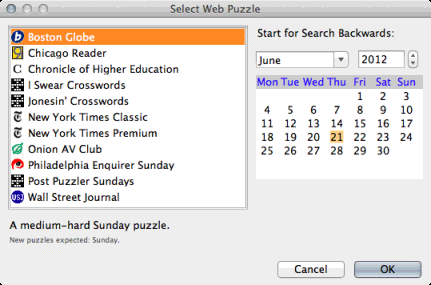

Web Crossword Puzzles
=====================

You can open puzzles directly from a number of popular crossword sites.
There are sites that are pre-configured in the program, and you can
add other sites as well (see Preferences).

To open a web-based crossword, you can start one of several ways:

- If you get the "welcome" box when you start up, you can click on
  `Open Web Puzzle`. This will give you a dialog of sites to choose from.

- Choose `File` |rarr| `Web Puzzle Chooser`. This will give you the same
  dialog.

- Choose `File` |rarr| `Open Web Puzzle` and pick the puzzle directly from
  the submenu. This will open the most recently-available puzzle from
  that puzzle source.

Web Puzzle Chooser
------------------

The Web Puzzle chooser shows the sites you can select a puzzle from, along
with a date-picker to choose the date to begin looking for the selected puzzle:

   Web Puzzle Chooser.

Different puzzles are released on different days of the week; you can find
out which days puzzles are expected, along with a description of the puzzle
source, in descriptive text below the list.

For example, the New York Times Classic puzzle is released every Monday. If you
leave the date picker on the default, today's date, it will automatically look
backward to the first Monday on or before today, and open that puzzle.  If you
wanted to specifically look for the puzzle released last week, you could change
the date picker to last Monday (or any date last week before this Monday, since
it knows to only look for this puzzle on Mondays).

In the event that a puzzle cannot be found on an expected day, it will continue
looking backwards until it finds a puzzle or it fails 3 attempts.

Once a puzzle is opened, it is saved in your Web Puzzles directory
and opened up for play.
